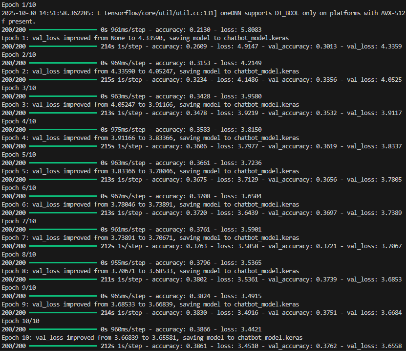
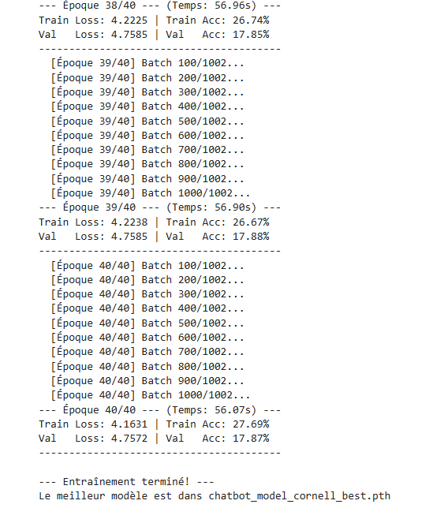

étapes:
- créer un venv
- pip install numpy, tensorflow
-lancer chat_cornell.py
-discuter

For the pytorch bot, i provided the model already trained, that shows the limits of the current architecture and dataset.
You just have to run cornell_chat.py and it should work.
Otherwise you can access the kaggle notebook i used to train it: https://www.kaggle.com/code/thurn4x/crazybot-cornell

Next steps are to use a model like gpt or bert and try to train it !
